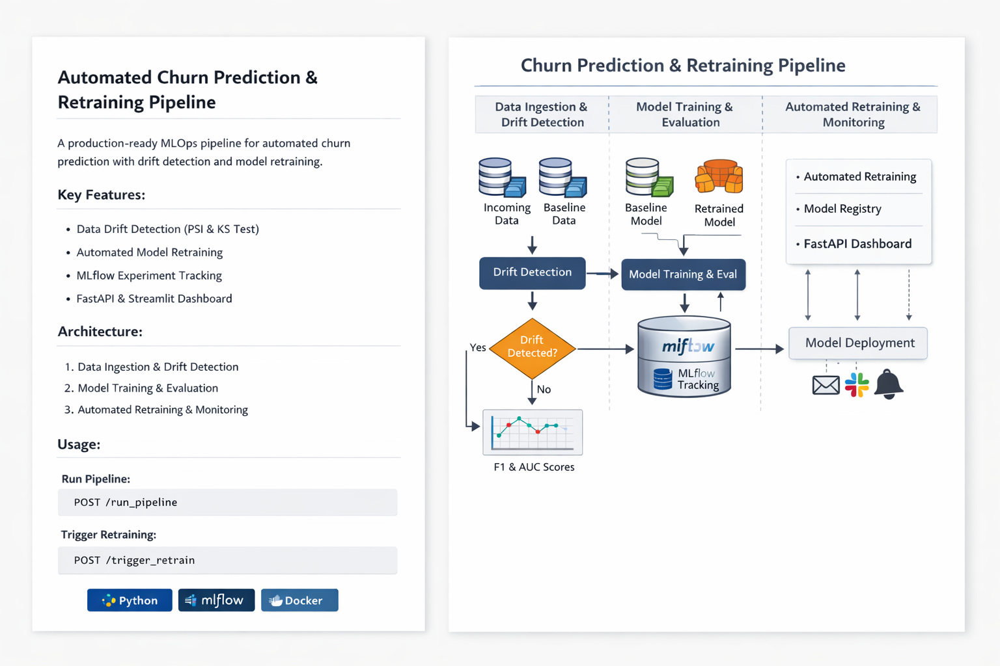
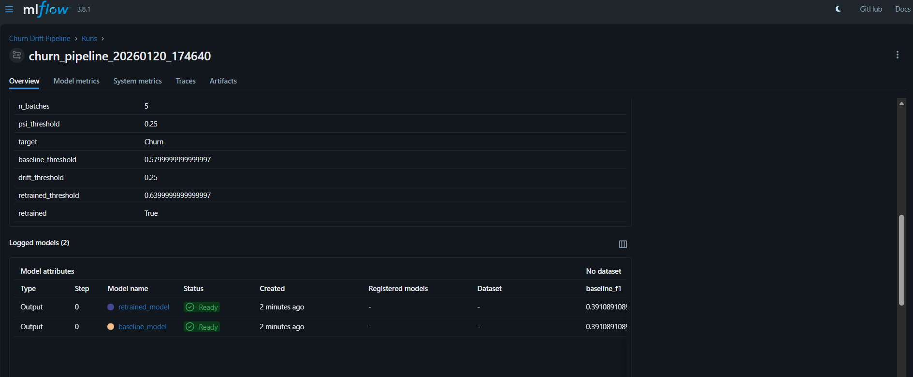
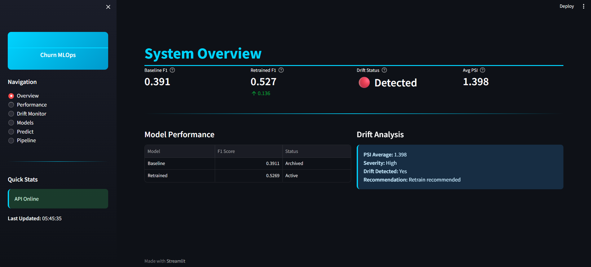
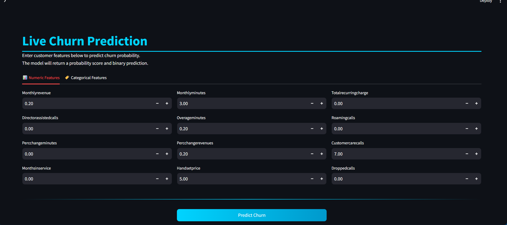
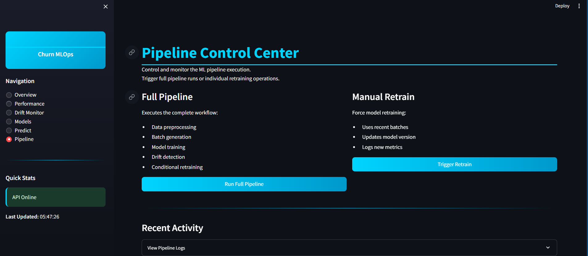

# Churn MLOps Platform

A **production-style MLOps system** for customer churn prediction with automated training, drift detection, retraining logic, monitoring dashboards, and API-based inference. This project simulates how real-world ML systems are built, deployed, monitored, and improved over time.

---

##  Key Features

### 1. End-to-End ML Pipeline
- Data ingestion & preprocessing
- Feature encoding & scaling
- Model training with XGBoost
- Model evaluation (F1, AUC)
- Model versioning
- Artifact storage

### 2. Drift Detection
- PSI (Population Stability Index)
- Kolmogorov–Smirnov test
- Feature-level drift analysis
- Overall drift decision

### 3. Automated Retraining Logic
- Drift-based retraining trigger
- Baseline vs retrained model comparison
- Performance delta tracking

### 4. Experiment Tracking (MLflow)
- Metrics logging
- Parameter tracking
- Model artifacts
- Versioned runs

### 5. FastAPI Inference Service
- `/predict` endpoint
- `/health` endpoint
- `/latest_metrics` endpoint
- `/models` endpoint
- `/trigger_retrain` endpoint

### 6. Streamlit Monitoring Dashboard
- Multi-page UI
- KPI cards (F1, AUC, PSI)
- Drift visualization
- Model version browser
- Manual retrain trigger

### 7. Dockerized Deployment
- API container
- Dashboard container
- Multi-service orchestration via Docker Compose

---

##  System Architecture

This system follows a modular, production-style architecture:

- **Data Layer** → Raw, processed, and batch-split datasets
- **Pipeline Layer** → Preprocessing, training, evaluation, drift detection
- **Tracking Layer** → MLflow for experiments & metrics
- **Serving Layer** → FastAPI model inference
- **Monitoring Layer** → Streamlit dashboard
- **Orchestration Layer** → Central pipeline controller



---

##  Project Structure
    
    cell2cell_churn_drift_extended/  # Root
    │
    ├── data/
    │
    ├── notebooks/  # EDA/experiments (optional)
    │   ├── 01_data_exploration.ipynb
    │   ├── 02_baseline_model.ipynb
    │   ├── 03_drift_analysis.ipynb
    │   └── 04_model_retraining.ipynb
    │
    ├── src/  # Core Python modules
    │   ├── data/  # Ingestion/processing
    │   │   ├── __init__.py
    │   │   ├── preprocessing.py  # Load, encode, scale
    │   │   ├── batch_generator.py  # Split batches
    │   │   └── validation.py  # Schema checks
    │   │
    │   ├── model/  # Training/eval/inference
    │   │   ├── __init__.py
    │   │   ├── train.py  # XGBoost + SMOTE + GridSearch
    │   │   ├── evaluate.py  # Metrics + PR curve
    │   │   ├── inference.py  # predict_churn
    │   │   └── versioning.py  # MLflow log
    │   │
    │   ├── drift/  # Detection/alerts
    │   │   ├── __init__.py
    │   │   ├── drift_detector.py  # PSI/KS calc
    │   │   ├── alerts.py  # Email/Slack
    │   │   └── monitor.py  # Periodic check
    │   │
    │   ├── pipeline/  # Orchestration
    │   │   ├── __init__.py
    │   │   ├── orchestrator.py  # Core steps 1-4
    │   │   ├── retrain_trigger.py  # Drift logic
    │   │   └── scheduler.py  # Schedule wrapper
    │   │
    │   ├── api/  # FastAPI serving
    │   │   ├── __init__.py
    │   │   ├── app_full.py  # Endpoints (/predict, /drift_check, etc.)
    │   │   └── schemas.py  # Pydantic models
    │   │
    │   ├── dashboard/  # Streamlit UI
    │   │   ├── __init__.py
    │   │   └── dashboard.py  # Metrics, drift button, charts
    │   │
    │   ├── aws/  # AWS hooks (toggle with USE_AWS=True)
    │   │   ├── __init__.py
    │   │   ├── s3_upload.py  # Upload to S3
    │   │   ├── lambda_handler.py  # Drift alert Lambda
    │   │   ├── trigger_retrain.py  # Lambda trigger
    │   │   └── deploy_model.py  # EC2/S3 deploy
    │   │
    │   └── config.py  # Constants (paths, thresholds, USE_AWS=False)
    │
    ├── tests/  # Pytest (run `pytest tests/`)
    │   ├── test_preprocessing.py  # Data validation
    │   ├── test_model.py  # Train F1 >0.3
    │   ├── test_drift.py  # Drift detection
    │   └── test_api.py  # /predict 200 OK
    │
    ├── docker/  # Deployment
    │   ├── Dockerfile_api  # FastAPI container
    │   ├── Dockerfile_dashboard  # Streamlit container
    │   └── docker-compose.yml  # Services (api:10000, dashboard:10001)
    │
    ├── scripts/  # Entry points
    │   ├── run_pipeline.py  # Master orchestrator (MLflow, scheduler)
    │   ├── run_api.py  # FastAPI server
    │   └── run_dashboard.py  # Streamlit CLI
    │
    ├── models/  # Generated artifacts
    │   ├── baseline_model_improved.pkl
    │   ├── retrained_model_improved.pkl
    │   ├── baseline_pr_curve.png
    │   ├── retrained_pr_curve.png
    │   ├── baseline_metadata.json
    │   └── retrained_metadata.json
    │
    ├── logs/  # Generated runtime
    │   └── drift_alerts.log
    │
    ├── mlruns/  # MLflow artifacts (generated)
    │   └── 1/  # Churn Drift Pipeline (runs, metrics)
    │
    ├── mlflow_data/  # DB folder (from your config)
    │   └── mlflow.db  # SQLite backend
    │
    ├── requirements.txt  # Deps (xgboost 1.7.6, mlflow 2.9.0, etc.)
    ├── README.md  # Overview/run instructions
    ├── .env  # AWS keys (gitignore'd)
    ├── .gitignore  # Exclude data/models/mlruns
    └── setup.py  # Optional package install


---

##  Testing

This project includes automated tests using Pytest:

- Data validation tests
- Model training tests
- Drift detection tests
- API endpoint tests

---

##  How to Run

### 1. Install dependencies
```
pip install -r requirements.txt
Run the pipeline
python scripts/run_pipeline.py
```
3. Start API
```
python scripts/run_api.py
```
5. Start Dashboard
```
python scripts/run_dashboard.py
```
7. Docker (optional)
```
docker-compose up --build
```


---

## Technologies Used
Python | XGBoost | Scikit-learn | Pandas | NumPy | MLflow | FastAPI | Streamlit | Docker | Docker Compose | Matplotlib | Plotly | SciPy | Pytest | SQLite | (Future Enhancements AWS: EC2, S3, Lambda, Boto3)





